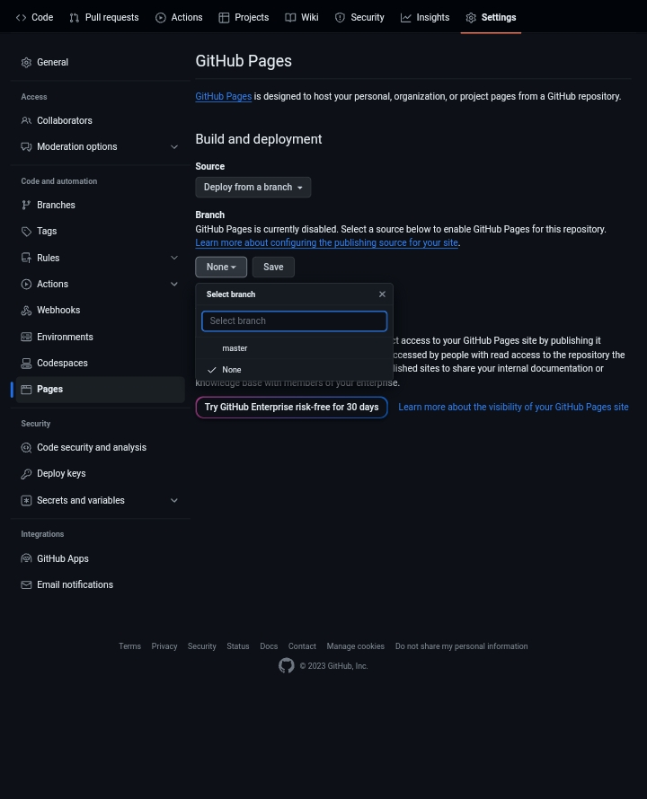

# rooted-cyber.github.io
first setup in this repo GitHub page settings 

select your branch and save
after few minutes check your website 
your website:- https://GitHubUsername.github.io/RepoName/

replace your GitHub username and repo name

after that you can see your GitHub repo website 👍🏻
